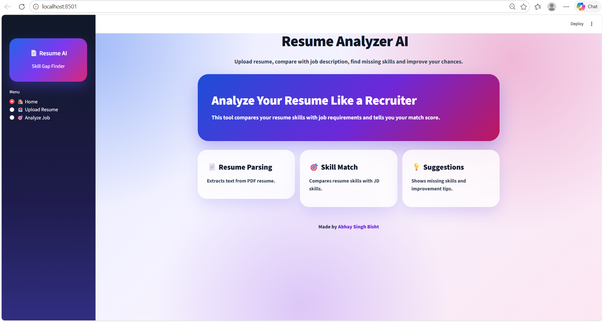
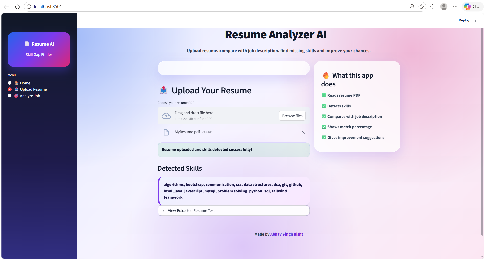
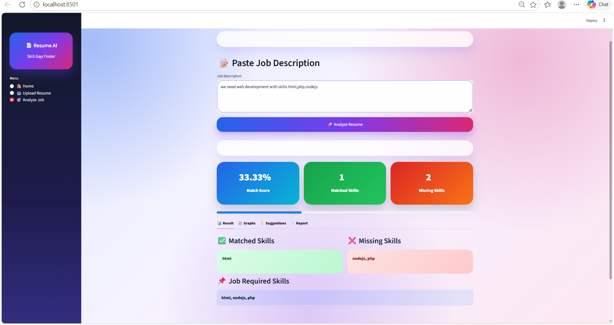
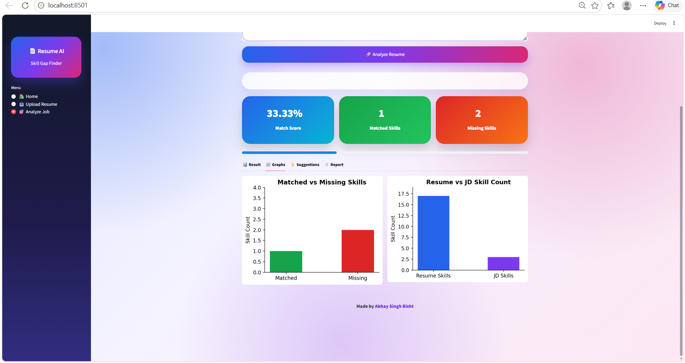
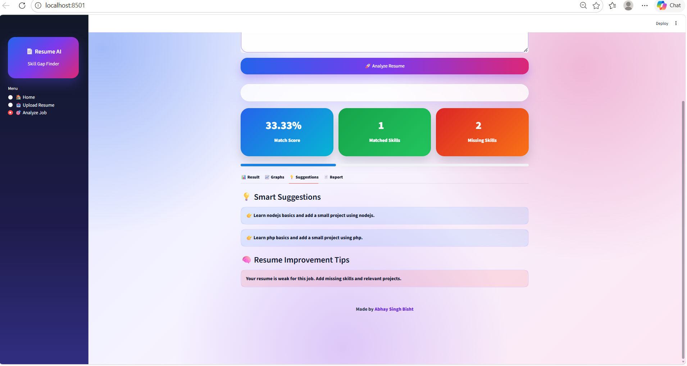

# Resume-Analyzer-AI-
AI tool that analyzes resume and compares it with job description to find skill gaps and match percentage.
# 🚀 Resume Analyzer AI + Skill Gap Finder

## 🔥 Features

- Upload Resume (PDF)
- Extract skills automatically
- Compare with Job Description
- Match Percentage calculation
- Missing Skills detection
- Smart Suggestions
- Interactive charts
- Clean & modern UI

## 🛠️ Tech Stack

- Python
- Streamlit
- PyPDF2
- Matplotlib
- HTML/CSS

## 📸 Demo

(Add screenshot here)
## 📸 Demo

### Home Page


### resume Page


### Result Page


### Charts


### Suggestion Page


## ▶️ Run Locally

```bash
pip install -r requirements.txt
streamlit run app.py